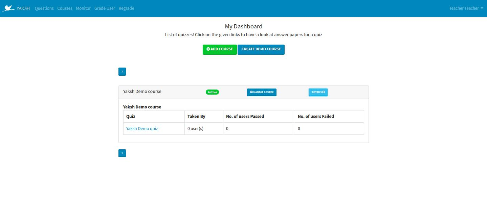

=====================
Moderator's Dashboard
=====================

On logging in moderators see the following dashboard. 

There are two options available:
    * **Add Course**
        It allows to create a new course.
    * **Create Demo Course**
        It creates a demo course contaning sample lesson and quiz with questions.

The dashboard contains all the courses. Each course provides two options
    
    * **Manage Course**
        Click on this button to manage the course. See the Manage course section
        in the :doc:`moderator_docs/creating_course` page for more details.
    * **Details**
        Clicking on the Details button shows all the quizzes in the course.
        Click on the quiz link to monitor the quiz.

The following pages explain the various functions available for moderators

.. toctree::

   moderator_docs/creating_course.rst
   moderator_docs/creating_quiz.rst
   moderator_docs/creating_question.rst
   moderator_docs/creating_lessons_modules.rst
   moderator_docs/other_features.rst