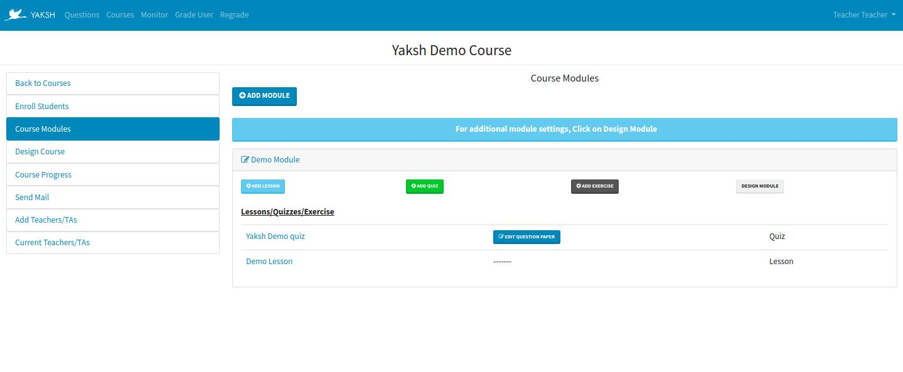

.. _creating_quiz:

=======
Quizzes
=======

Quizzes are intrinsically associated with a course, hence to view and/or edit a quiz, we need to navigate to the course details page by clicking on **Manage Course** button.

Clicking on **Course Modules** in the course details page will open the page as shown below

This page shows all the modules with quizzes and exercises.

Creating a Quiz
--------------- 

    Click on **Add Quiz** button to add a quiz.

    .. image:: ../images/add_quiz.jpg
    
    .. note :: It is important to have created or uploaded questions before creating a quiz. 

    * **Start Date and Time of quiz** - The date and time after which the quiz can be taken.
    * **End Date and Time of quiz** - The date and time after which the quiz is deactivated and cannot be attempted.
    * **Duration** - Duration of quiz to be written in minutes.
    * **Active** - Check the checkbox to activate/deactivate quiz.
    * **Description** - Description or name of the quiz.
    * **Passing Percentage** - Minimum percentage required to pass the test.
    * **Attempts allowed** - Number of attempts that a student can take of the current quiz.
    * **Time Between Quiz Attempts in hours** - For a quiz with multiple attempts this value can be set so that student can attempt again after the specified time.
    * **Instructions for students** - Additional instructions for students can be added. Some default instructions are already provided.
    * **Allow student to view answer paper** - Click on this checkbox to allow student to view their answer paper.
    * **Allow student to skip questions** - Click on this checkbox to allow/disallow student to skip questions for a quiz. Value defaults to allow skipping questions.
    * **Weightage** - Every quiz will have weightage depending on which grades will be calculated.

    Once a quiz parameters have been set click on **Save** button to save the quiz.

    To create a Question paper, Click on **Add Question Paper** link located
    besides the created quiz.

Creating a Exercise
------------------- 

    Click on **Add New Exercise** button to add a exercise.

    .. image:: ../images/add_exercise.jpg

    Exercise is similar to quiz with a difference that exercise has infinite attempts and 
    infinite time. It also does not allow a student to skip the question.
    Each question in an exercise can be timed i.e. time to solve a particular question.
    Once the question time expires, question solution is shown to the student.

    All the parameters are set by default only below parameters can be changed.

    * **Description** - Description or name of the exercise.
    * **Allow student to view answer paper** - Click on this checkbox to allow student to view their answer paper.
    * **Active** - Select the checkbox to activate/deactivate exercise. Default value is active.

    To create a Question paper, Click on **Add Question Paper** link located besides the created exercise.

Designing Question Paper
------------------------

    .. image:: ../images/design_questionpaper.jpg

    A quiz/exercise can have fixed as well as random questions. Fixed questions are those question that are bound to appear for every student taking the quiz. In random questions a pool of questions is given and number of questions to be picked from the pool is set. Hence for different students, different questions from the pool will appear.

    To add questions to a questionpaper

    * Select Question type and marks and a list of questions will be displayed will be in the **select questions to add** section. Do this for both fixed questions and random questions.
    * You can also search for questions using the tags added while creating the question. All the available tags are shown.
    * After adding questions click on **Next** button to go to **Step 3 Finish**.
    * Select **Shuffle questions' order for each student** if you want to jumble up the question sequence for every student and for every attempt.
    * Select **Shuffle MCQ/MCC options for each student** if you want to jumble up the MCQ/MCC question options for every student and for every attempt.  
    * Click on **Save** to save it.

Editing a Quiz/Exercise
-----------------------

    Click on the quiz/exercise link to edit, change the parameters and click on Save.
    Options Available once the Quiz is created.

        * **Preview Question Paper**
            Click on the Preview Question Paper button located at the bottom of the
            page to preview all the questions available in the question paper of the
            quiz.
        * **User Mode**
            Attempt quiz the way student will attempt i.e. -
                Quiz will have the same duration as that of the original quiz.

                Quiz won't start if the course is inactive or the quiz time has expired.

        * **God Mode**
            Attempt quiz without any time or eligibilty constraints.

Editing a QuestionPaper
-----------------------

    Click on the **Edit Question Paper** besides Quiz/Exercise and follow steps from Design Question Paper.

    If the questions are already added to a Question Paper then they are shown in the 
    **Fixed Questions currently in the paper** section.
